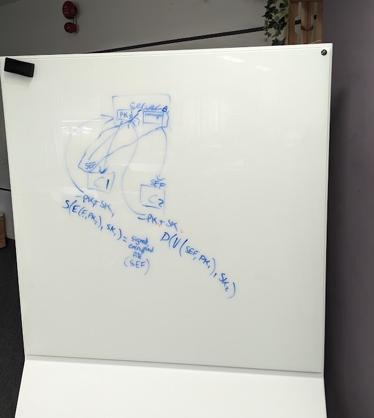
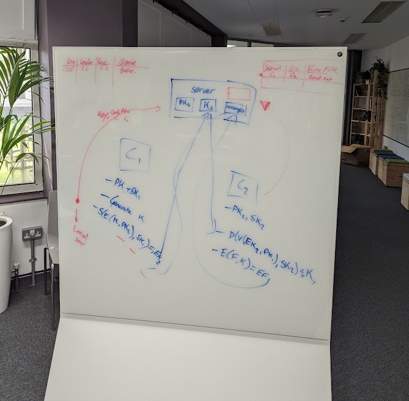
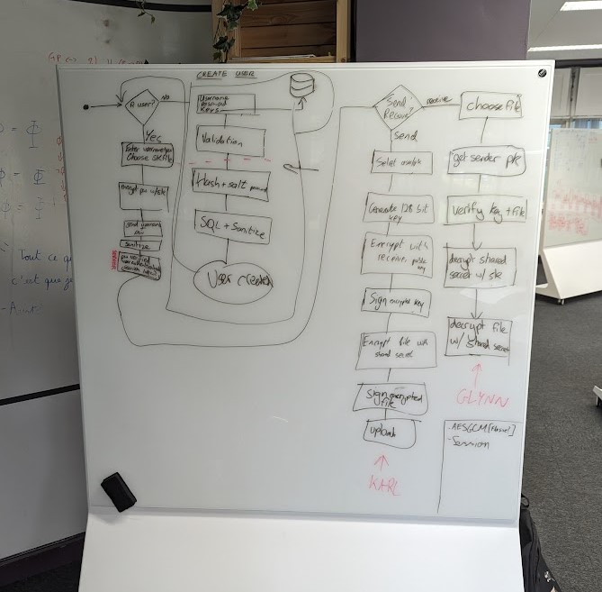

# Secure File Transfer Application - The Real Glynn Shady
LM173- CS4455 - Cybersecurity & Cryptography <br>
Conor Callanan, Conor Glynn, Karl Gilmartin

## Summary

This project implements a secure, end-to-end encrypted file-sharing application. The application ensures that all communications between users are secure, authenticated, and verifiable to protect against unauthorized access and tampering.


## Features

- **User Registration and Authentication**: Secure user registration and login system using secure passwords and session tokens.
- **End-to-End Encryption**: Client-side encryption and decryption to ensure files are only readable by intended recipients.Files remain encrypted on the server.
- **File Upload and Download**: Authenticated users can upload files securly and only the intended recipient can download the file.
- **Digital Signatures**: Ensure integrity and authenticity of the files and shared keys.
- **Session Tokens**: Use of JWT to limit the number of times a user can try to log in and to maintain the users session.


## Overview

### User Registration and Authentication
- Users can create an account with a username and password.
- For each subsequent login, the user must provide their username and password.
- The server stores the user's password securely using a salted hash.
- JWT tokens are used to limimt the numebr of times a user can try to logged in.
- The server generates a session token for each user after successful login.
- The session token is used to authenticate the user for subsequent requests.
- If the user reaches the maximum number of login attempts, the user must complete the captcha to login.

### End-to-End Encryption
- Shared key is generated using RSA and encrypted using the recipient's public key.
- A shared key is generated for each file and shared with the intended recipient.
- Files are encrypted on the client-side before being uploaded to the server using AES (CTR mode).
- The server stores the encrypted file, sender, receiptent, encrypted shared key.
- Files are decrypted on the client-side after being downloaded from the server.
- Receivers must first decrypt the shared key using their private key before decrypting the file.

### Digital Signatures
- Files and shared keys are signed using the sender's private key to ensure integrity and authenticity.
- Receivers can verify the signature using the sender's public key.

### Database Security
- User passwords are stored securely using a salted hash.
- Regex and sanaity checks are used to ensure that the data is valid.


## Tech Stack

- **Backend**: Python (FastAPI)
- **Database**: SQLite
- **Encryption**: RSA, AES (CTR mode)

## Installation

### Setup

1. **Clone the repository**:
   ```sh
   git clone https://github.com/ConorCallanan2003/cryptography-assignment
    ```

2. **Install prerecquites - Client**:
    ```sh
    cd cryptography-assignment/client
    pip install -r requirements.txt
   ```
3. **Install prerecquites - Server**:
    ```sh
    cd..
    cd server/
    pip install -r requirements.txt
    ```
5. **Run the server**
    ```sh
    uvicorn server:app --reload 
    ```
6. **Run the client**
    ```sh
    cd ../client
    python3 client.py
    ```
## Planning
Here are some photos from our planning meetings, with different versions of our project.

**Version 1:** <br>



Using only Assemectric encryption with the public and private keys of sender and receiver for both encryption and signatures. Limitations: slow, size limit. <br>

**Version 2 :**

<br>
Generating a shared private key for semmectric encryption. Using RSA for sending the shared key and AES for the file encryption. Using digital signatures. Limitations: lack of enchanced safety features such as password, jwts <br>

<br>

**Version 3 (Final Version):**


Pros: Added user login and registration, JWTs, captcha, jwt block list. <br>
